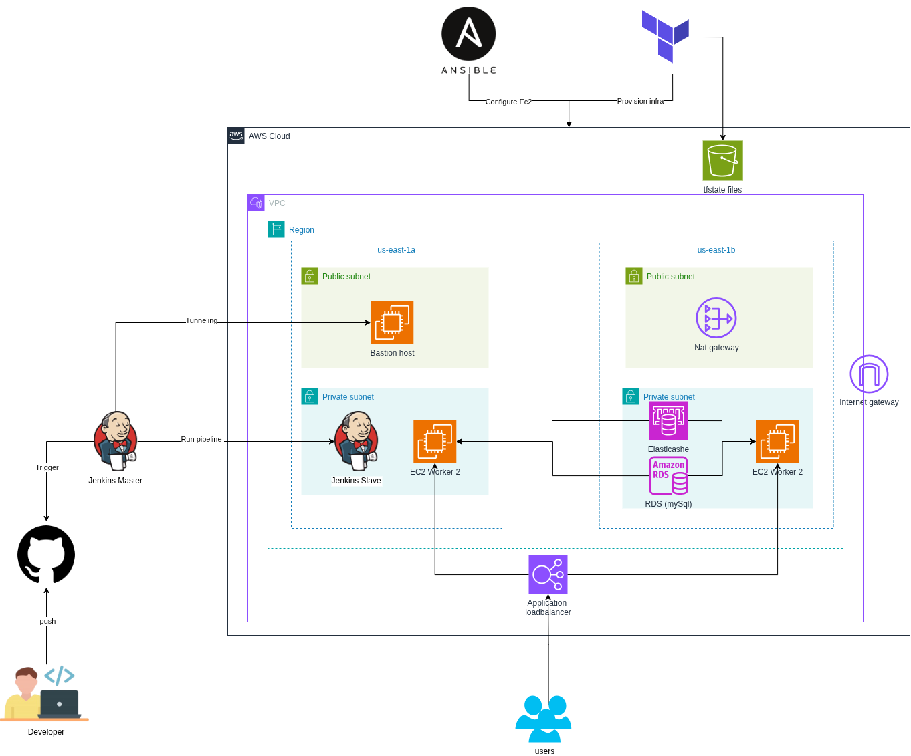
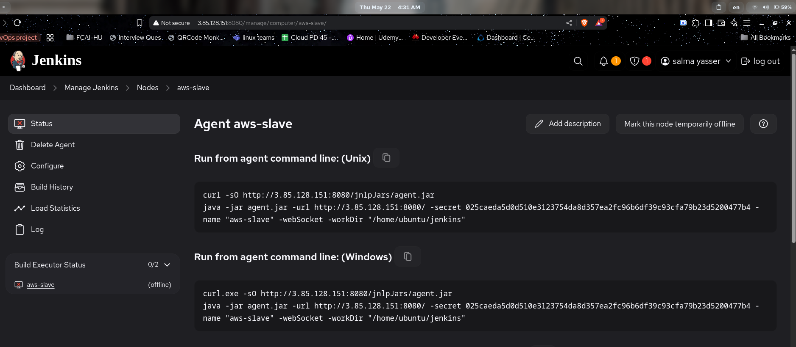
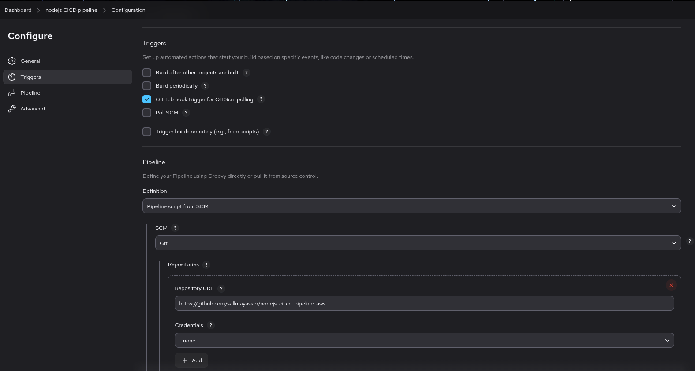
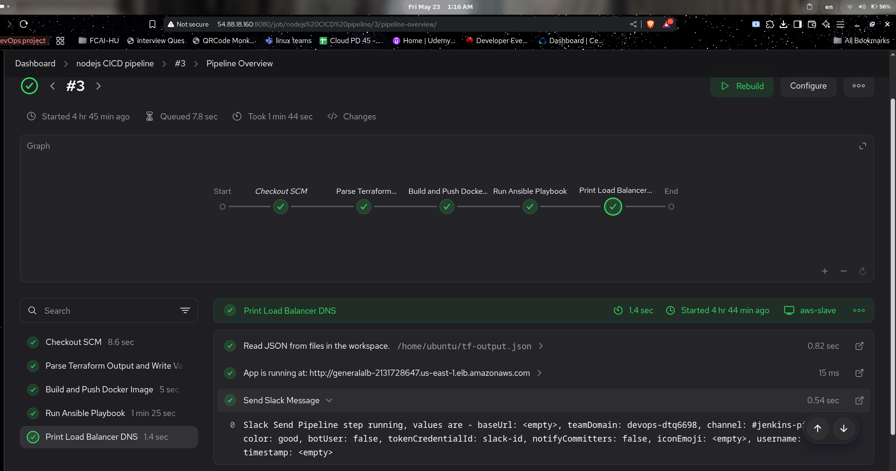

# 🚀 DevOps Node.js Jenkins AWS

**End-to-End DevOps Pipeline for Scalable Node.js Application with Jenkins, RDS, Redis, and Load Balancer on AWS**

## 📌 Project Describtion

This project showcases a complete DevOps pipeline to provision, configure, and deploy a containerized Node.js application on AWS, using fully automated Infrastructure as Code and configuration management tools.

## 📖 Overview

This project demonstrates a complete DevOps workflow to deploy a scalable Node.js application using:

- **Terraform** for AWS infrastructure provisioning
- **Ansible** for EC2 instance configuration
- **Jenkins** for automating CI/CD pipelines
- **Docker** to containerize the Node.js application
- **Application Load Balancer (ALB)** for public access on port 80
- **Amazon RDS (MySQL)** for relational data persistence
- **Amazon ElastiCache (Redis)** for caching
- **Bastion Host** to securely access private EC2 instances
- **Slack** for real-time pipeline notification alerts

The Node.js app is containerized using Docker, deployed on a private EC2 instance, and exposed to the internet via an ALB. Jenkins handles build and deployment, and notifies the team on Slack with pipeline status updates.

---

## 🔧 Key Features:

Infrastructure Provisioning: Built using Terraform, including VPC, subnets, security groups, EC2 instances, RDS (MySQL), ElastiCache (Redis), ALB, and Bastion host.

Configuration Management: Automated with Ansible and Ansible Roles for modular, reusable setup of Node.js environments.

CI/CD Pipeline: Powered by Jenkins, with Git integration, Docker image builds, and Slack notifications for deployment status.

Secure Networking: Utilizes a Bastion Host and SSH ProxyJump to safely access private EC2 instances.

SSH Tunneling: Implements a reverse SSH tunnel to expose local services securely through the Bastion host.

Custom Bash Scripts: Automates:

- Terraform execution

- Inventory and SSH configuration generation

- Ansible playbook execution

- Bastion configuration and tunneling

## 🧰 Tech Stack

| Layer            | Tool/Service               |
| ---------------- | -------------------------- |
| Infrastructure   | Terraform                  |
| Configuration    | Ansible                    |
| CI/CD            | Jenkins (Pipeline)         |
| Containerization | Docker                     |
| Notifications    | Slack                      |
| Application      | Node.js (Express)          |
| Data Persistence | Amazon RDS (MySQL)         |
| Caching          | Amazon ElastiCache (Redis) |
| Network          | AWS VPC, ALB, Bastion Host |

---

## 📦 Features

- Automated AWS provisioning using Terraform
- Secure infrastructure using private EC2s and Bastion Host
- Continuous integration & deployment via Jenkins
- Real-time Slack alerts on pipeline execution
- Node.js containerized with Docker for portability
- Scalable architecture using ALB
- Persistent data with RDS and fast caching with Redis

---

## infrastructure



## 🔁 Fork & Clone the Repo

1-Fork this repo: https://github.com/sallmayasser/nodejs-ci-cd-pipeline-aws.git

2-Clone your fork:

```
git clone https://github.com/sallmayasser/nodejs-ci-cd-pipeline-aws.git
cd jenkins-devops-project
```

## 🚀 Project Setup

### ✅ Step 1: run master container with pv

```
docker container run -d -v jenkins_home:/var/jenkins_home -p 8080:8080 --name jenkins_master jenkins/jenkins:lts
```

## Step 2: Run the deploy script

in this path ./jenkins-devops-project run :

```
./scripts/deploy.sh <db_username> <db_password>
```

this script run the following :

1. Terraform apply
2. Extract the output in separte file
3. Write the inventory file
4. configure the ~/.ssh/config file
5. Run the main playbook to configure jenkins slaves
6. Enable port forwarding on bastion
7. Starting reverse SSH tunnel from local to Bastion Host

Deploy script output <br>


## Step 3: Add bastion host as Reverse proxy on dashboard

open manage --> system --> jenkins location (Add the Bation IP )<br.>


## Step 4: Configure the jenkins slave node manually on dashboard

Get the agent setup script from: Manage Jenkins --> Nodes --> New Node:




Then on the Jenkins slave

```
curl -sO http://<Bastion host ip>:8080/jnlpJars/agent.jar
java -jar agent.jar -url http://<Bastion host ip>:8080/ -secret 025caeda5d0d510e3123754da8d357ea2fc96b6df39c93cfa79b23d5200477b4 -name "aws-slave" -webSocket -workDir "/home/ubuntu/jenkins"
```


## Step 5: Create github webhook and pipeline on jenkis

### create webhook


### create pipeline

new item --> pipeline --> triggers --> Github hook


## Step 6: Push Changes on Github & Trigger Pipeline

### pushing the code


### the pipeline output


### pipeline stages



## Step 7: Verify pipeline stages on slack


## 🧑‍💻 Author

salma yasser <br>
DevOps Engineer <br>
📧 [sallmayasser512@gmail.com](mailto:sallmayasser512@gmail.com) <br>
🔗 [LinkedIn](https://www.linkedin.com/in/sallma-yasser)
